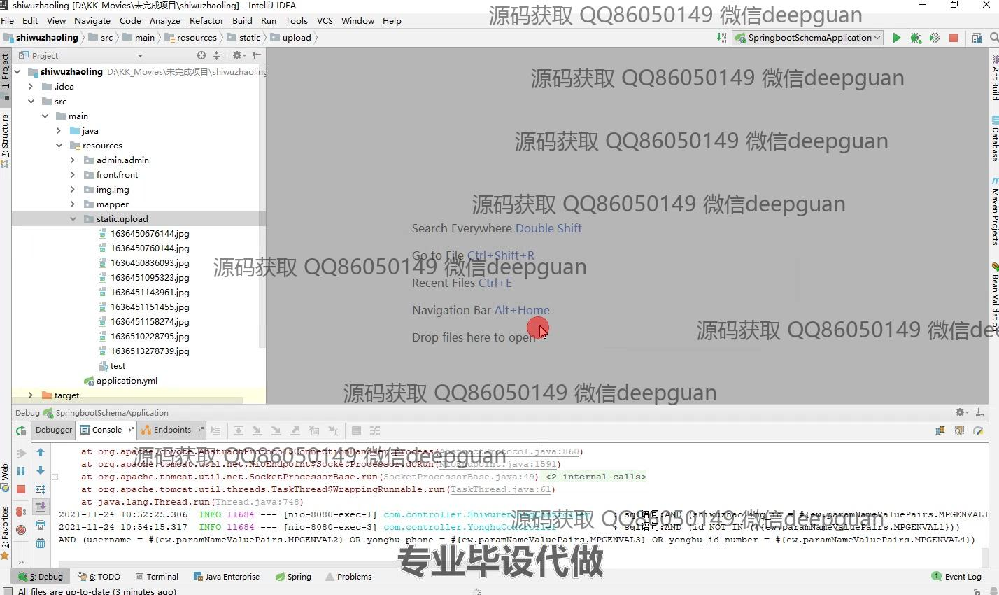
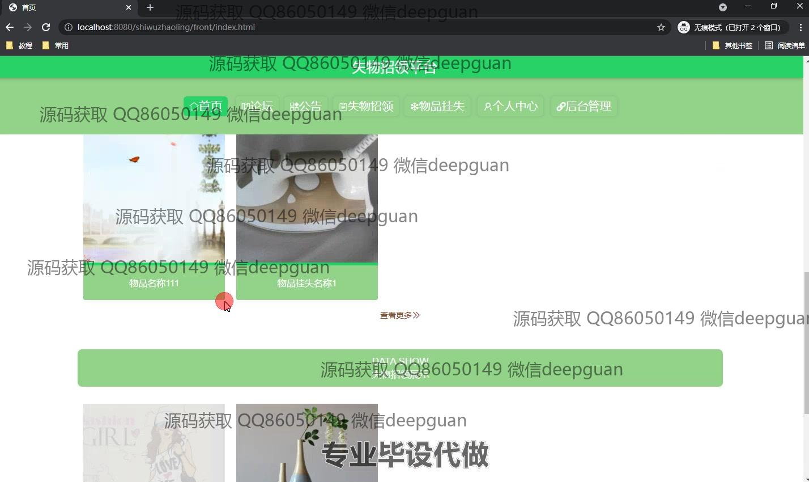

<h1 align="center">基于SpringBoot的失物招领平台的设计与实现</h1>

## 简介
基于SpringBoot的失物招领平台包括用户和管理员角色，主要功能有用户注册、失物招领管理、物品挂失管理、论坛发布和后台管理，支持失物信息的查询、上传、编辑与审核，提供简洁友好的用户体验。    --计算机毕业设计源码；毕设源码；java毕业设计源码

## 联系方式

<h3 align="center">获取完整代码与数据库文件 + 微信：deepguan QQ: 86050149 QQ群: 783742310</h3>

<h3 align="center">可帮忙远程部署 包运行成功！提供远程部署、修改代码、设计文档指导、代码讲解等服务！</h3>

## 功能介绍（完整见运行截图）
管理员： 基本功能包括登录、注册和退出，管理平台的首页提供主要的导航栏及公告展示。管理员可以通过后台界面对失物信息进行添加、查询、编辑和删除操作，通过搜索栏可根据物品名称、类型、状态进行过滤查询，进行用户管理、物品管理和论坛管理。此外，管理员还能查看物品的详细信息、审核状态和进行认领确认、操作记录等。

用户： 用户注册页允许填写用户名、密码、昵称等信息，并有性别和身份证等选项。用户可以登录平台后进入个人中心查看和编辑账户信息，如用户名、性别及身份证号。用户通过平台能够公告查看最近的公告信息，进入论坛模块发布帖子与其他用户交流，进行失物招领、物品挂失的上传操作和相关信息管理。用户界面设计注重简洁和用户体验，支持快速切换至各功能模块。

## 运行截图

本代码来源于网络,仅供学习参考使用!

